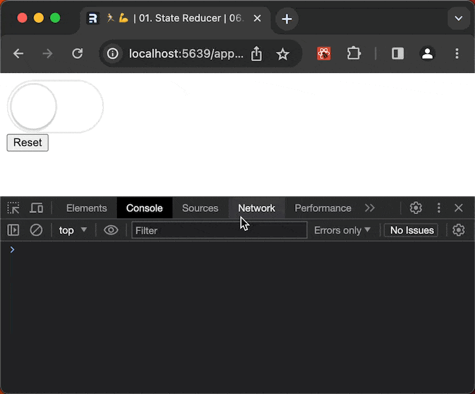
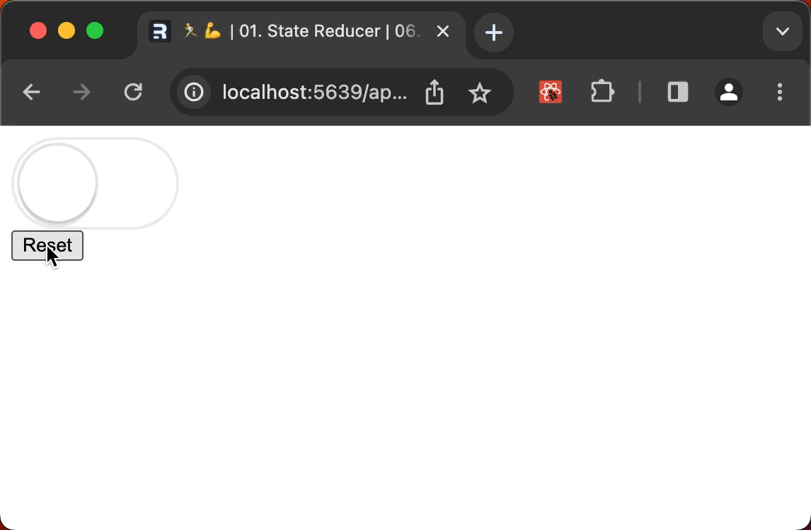

## Add a state reducer option to the `useToggle` hook

> This lesson is part of the epicreact.dev's Advanced React Patterns module

OK! Let's invert control of our `useToggle` hook.
We only need to make one major change to our implementation.
So,

- Open the `toggle`, module.
- In the `useToggle` hook, take `reducer` as an option.
- And replace all local `toggleReducer` calls with the optional `reducer`.

```tsx title="toggle.tsx" ins=/, reducer/ del=/toggleReducer/ ins=/reducer/
export function useToggle({ initialOn = false, reducer } = {}) {
  const { current: initialState } = React.useRef<ToggleState>({
    on: initialOn,
  });
  const [state, dispatch] = React.useReducer(
    toggleReducerreducer,
    initialState
  );
  /* ...rest of implementation... */
}
```

Unfortunately, _requiring_ a `reducer` function (as an argument) has the undesirable effect of breaking it everywhere that a reducer isn't defined.

:::hidden-script

Run code and highlight `reducer is not a function` error.
:::



## Assign a default state reducer to retain existing behavior

We can retain the previous experience with a [default value assignment](https://developer.mozilla.org/en-US/docs/Web/JavaScript/Reference/Functions/Default_parameters#destructured_parameter_with_default_value_assignment) syntax.

- Add `toggleReducer` as the default assignment for `reducer`
  - This is used only if the value is `undefined`.
- Note: that this resolves our TypeScript errors and the UI continues to works as it did before.

```tsx ins=/ = toggleReducer/
// toggle.tsx
export function useToggle({
  initialOn = false,
  reducer = toggleReducer,
} = {}) {
  /* ...rest of implementation... */
}
```



## Provide a custom state reducer at the the call site

Now we can override the default `toggleReducer` — by providing a `reducer` option. Let's provide a state reducer function that dispables the toggle when we've hit our click limit.

- For now, copy the `toggleReducer` declaration and paste it into the `app` module — passing it in as `reducer`.
- (Don't worry, we'll come back to fix the types after we get it working)

```tsx ins={2-14} title="app.tsx"
const { on, getTogglerProps, getResetterProps } = useToggle({
  reducer(state: ToggleState, action: ToggleAction) {
    switch (action.type) {
      case "toggle": {
        return { on: !state.on };
      }
      case "reset": {
        return action.initialState;
      }
    }
  },
});
```

With our override state reducer in place, add the additional `toggle` logic.

- For the `toggle` action, add a condition
- If `clickedTooMuch` is truthy, return the current (unmodified) state.

```tsx ins={8-10} title="app.tsx"
const { on, getTogglerProps, getResetterProps } = useToggle({
  reducer: function toggleReducer(
    state: ToggleState,
    action: ToggleAction
  ) {
    switch (action.type) {
      case "toggle": {
        if (clickedTooMuch) {
          return state;
        }
        return { on: !state.on };
      }
      case "reset": {
        return action.initialState;
      }
    }
  },
});
```

## What we did

We've made it possible to override the default behavior of our `useToggle` hook, at the call site. This lets others extend the hook's capabilities _without_ having to modify the original code!

And by using the keeping the previous implementation as default, we've protecting exitisting code from a breaking change.

## Resolving the TypeScript errors

All that's left is to fix the TypeScript errors.

[Marker: TypeScript]

- Open the `toggle` module.
- Export the two type definitions that we now need access to in the `app` module.
- Go back to the `app` module.
- In VS Code,
  - Hover the error.
  - And select `Quick Fix` (or type <kbd>⌘.</kbd>).
- We can select `Update import from "./toggle"` for each import. Or `Add all missing imports` and add them all in one go.
- If using a different editor, manually add the types to the `toggle` module statement.

```tsx title="toggle.tsx" ins={2-3}
import {
  ToggleAction,
  ToggleState,
  useToggle,
} from "./toggle.tsx";
/* ...rest of implementation... */
```
