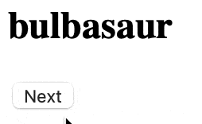

`startTransition` is a great first step for stabilizing UIs by showing a "stale" view while a next view resolves.

But stabilizing a view is just the first step. We should communicate somehow that the view is stale.

We can do that with `useTransition`.

`useTransition` is an ever-so-slightly more complex hook. Like `useState`, it returns a tuple with. The first argument is the pending state of the transition. The second is the same function as the `startTransition` hook.

It looks like this:

```js
let [isPending, startTransition] = React.useTransition()
```

That first element, that we named `isPending`, is a boolean that expresses if the transition is transitioning. And we can use it selectively to add styles or elements.

In [this week's StackBlitz demo](https://stackblitz.com/edit/react-ezhhj6?file=src/App.js), we've use `isPending`, and state-specific styles, to lower the opacity of the "stale" view.

```jsx
<div style={{ opacity: isPending ? 0.5 : 1 }}>
```



The button stays interactable while the UI provides immediate feedback to the user that something is happening.

How would you take this further to provide an even better experience?

🐦 [chantastic](https://chan.dev/twitter)

<div class="flex">

[⬅️ back](/lessons/reactholiday/2021/16)

<div class="mx-auto"></div>

[forward ➡️](/lessons/reactholiday/2021/18)

</div>
