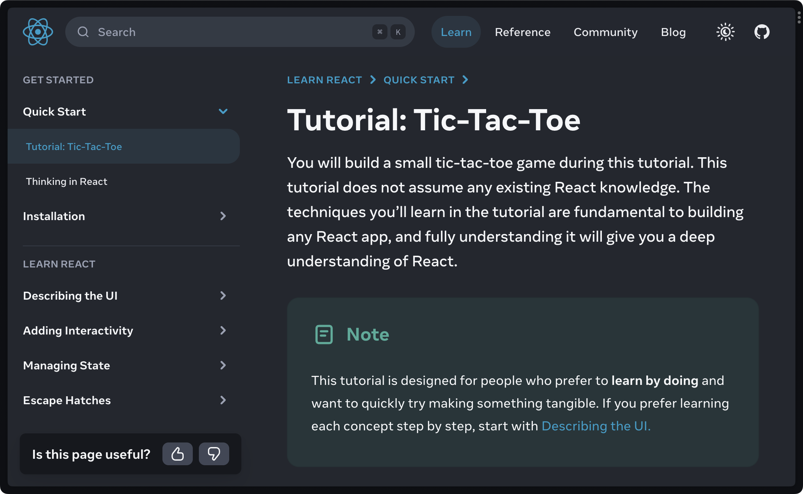
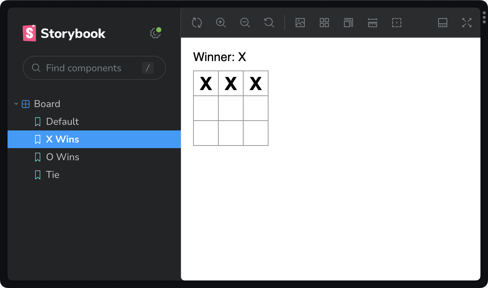
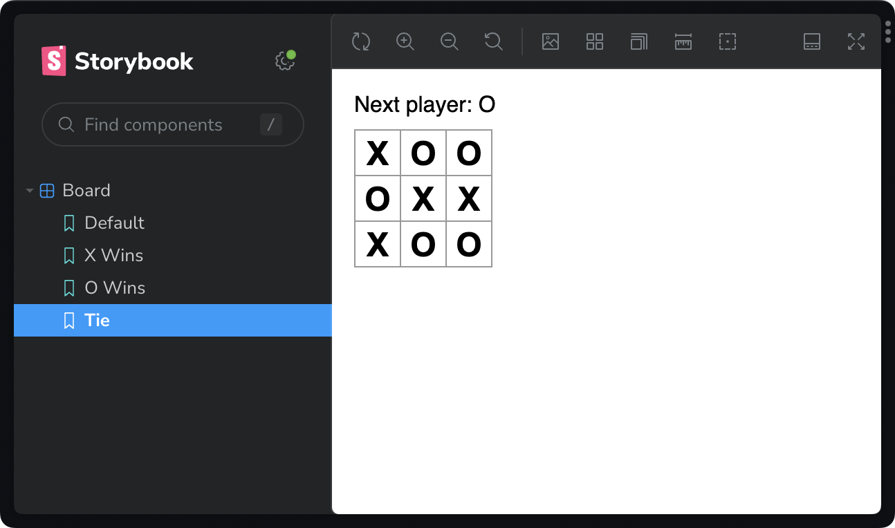
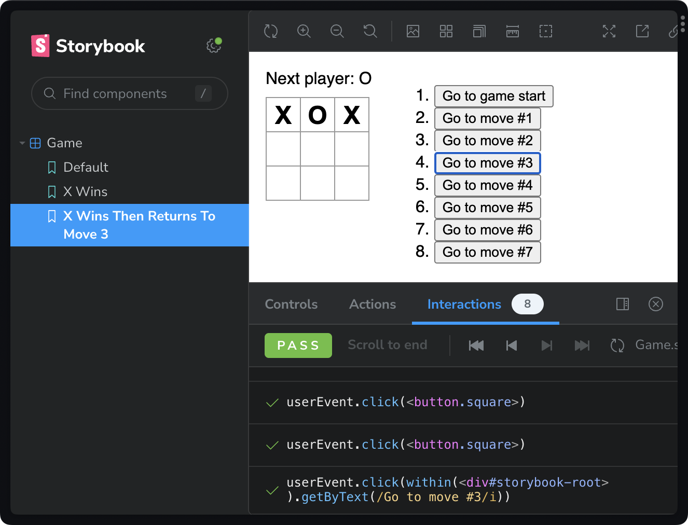
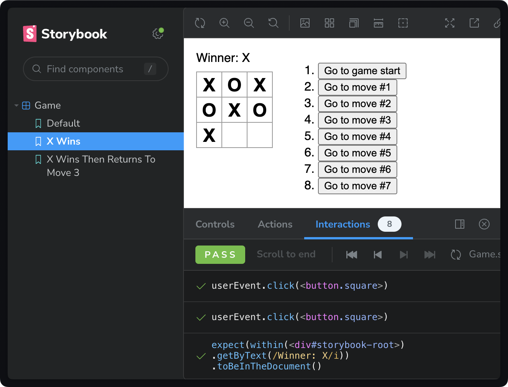

Testing is important import but testing the right thing, at the right level can be the difference between preventing future bugs and creating them.

Let's look at why interaction testing — in the browser — provides the most value for effort.

:::hidden-script

[illustration] showing tests playing and stepping back over user events.
:::

Let's dive in.


## Prerequisite



Before we start, take a look at the [tic-tac-toe tutorial](https://react.dev/learn/tutorial-tic-tac-toe) over on the React docs.

:::hidden-script

[illustration] show react.dev/learn page. scanning over tutorial.
:::

We won't be going thru that tutorial. But we will that final component as a starting point for interactive component testing.

## The wrong way: unit tests



Let's start by testing this component the wrong way with unit tests.

When unit testing, my inclination is to reach for some easy tests.
Testing components the way code is written.

I'd start by export the `Board` component and passing passing full boards as props.

```tsx title="Beard.stories.tsx"
import { Board } from "./App";

export default {
  component: Board,
};

export const Default = {};

export const XWins = {
  args: {
    squares: [
      "X",
      "X",
      "X",
      null,
      null,
      null,
      null,
      null,
      null,
    ],
  },
};
```

This is bad because it violates two pretty important principles.

1. Private methods should only be tested thru public interfaces.
2. Test data should match actual usage.

:::hidden-script

se new plugin to show as list items.
:::

And here I am exporting components just to test them and passing in impossible states.

To illustrate why bad test data is a problem, check this eventual test out.

```tsx title="Board.tsx"
export const Tie = {
  args: {
    squares: ["X", "O", "O", "O", "X", "X", "X", "O", "O"],
  },
};
```



It looks reasonable for a tie game. But it results in an impossible UI state where `O` is the next player — even tho there are more `O`s on the board than `X`s.

We may be inclined to solve this as a bug but we're resolving an impossible statet that a user would never experience. Wasted effort and unecessary complexty.

Let's stop here and start testing the right way.

## Test UI with interaction tests


"Virtuous friction." Test from the outermost interface and only change the code if it makes a practical improvement to the user experience.

When we setup a testing-library test and realize that there's no easy way to query the different buttons, we realize that we have an accessibility issue.

- Delete Board

- I might export Board as a public component.
- Then force some UI states using the props.

- tic tac toe is a famous react tutorial. Let’s talk about interaction testing and how testing in the browser makes us think about UI tests differently than unit tests.

- The problem with unit tests
- Impossible states. Props only

- upgrade to interaction test
- Use events

- Abstract and replay interaction tests between tests (spread play functions)






